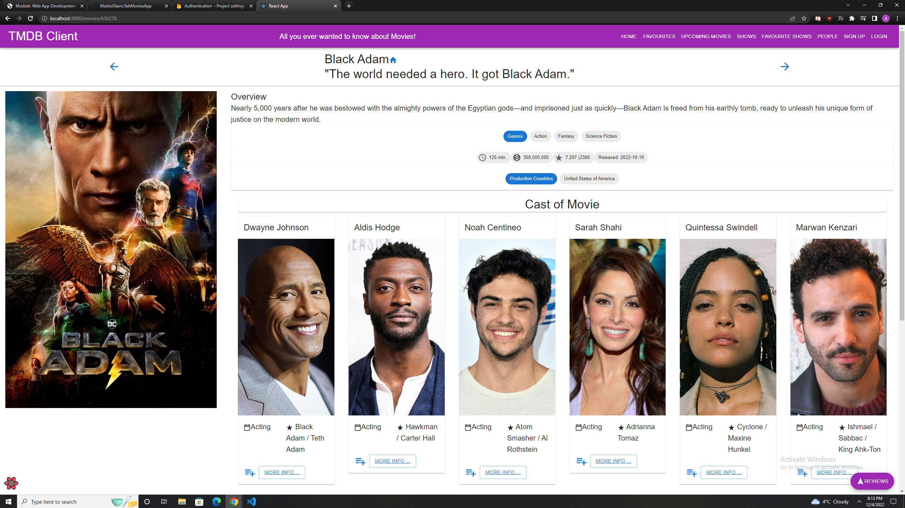
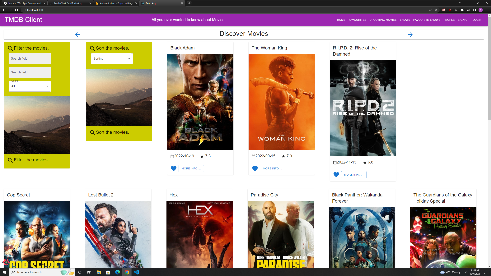
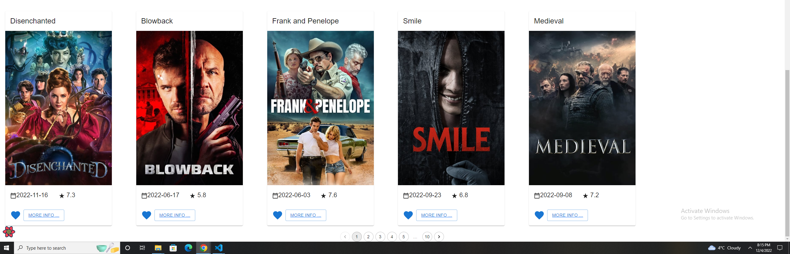
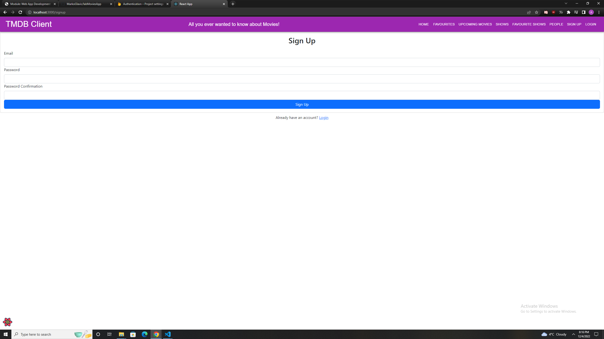
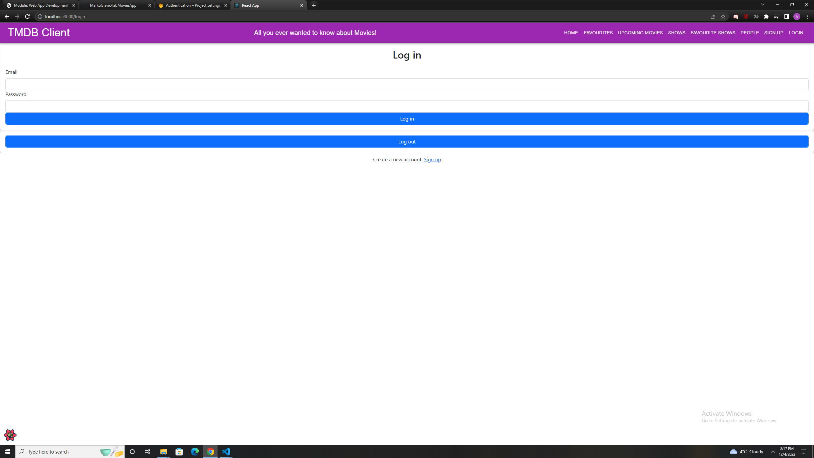
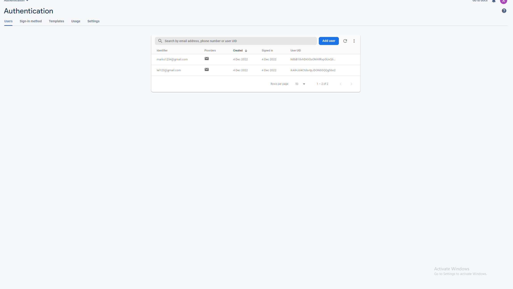
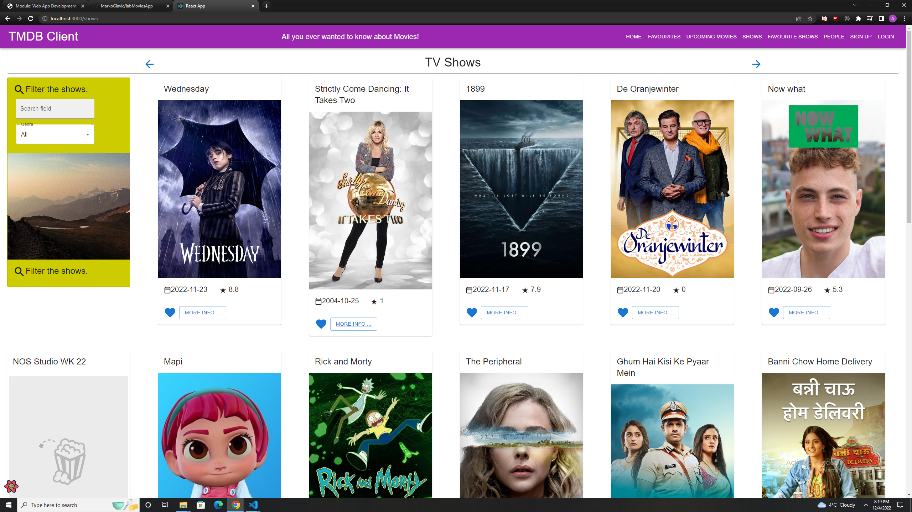
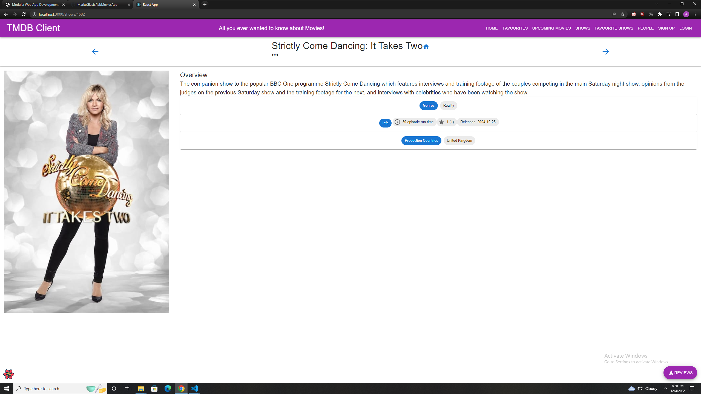
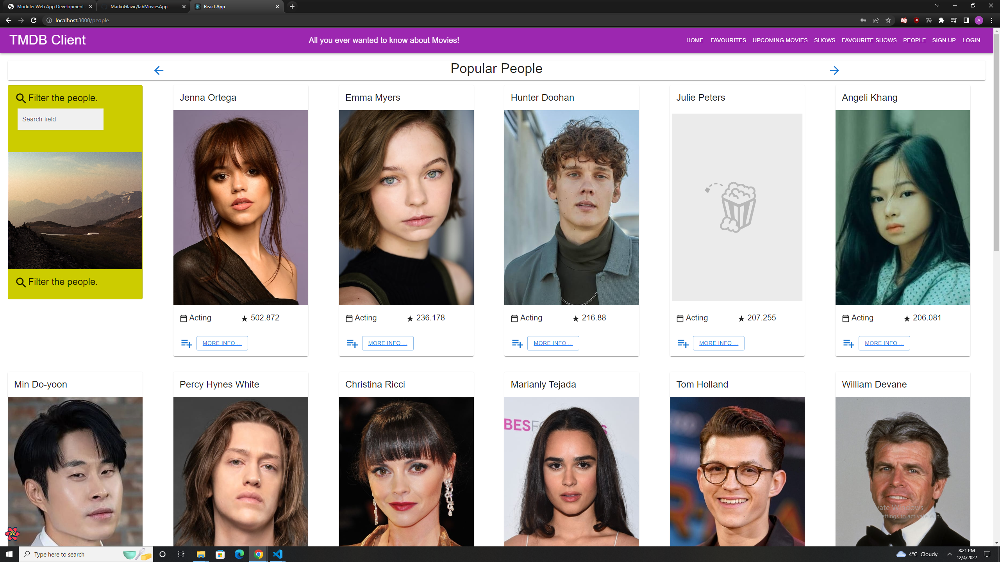
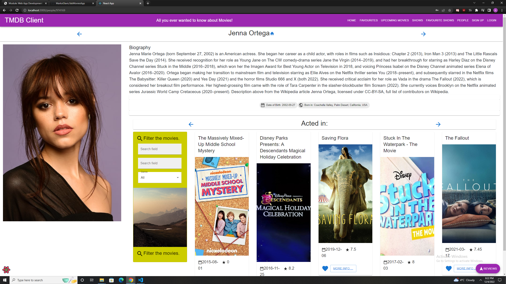

# Web App Dev 2 - Assignment 1 - ReactJS app.

Name: Marko Glavic

## Overview.

### New Pages.

+ List of shows
+ List of actors
+ Detail view of actors and list of movies the actor acted in
+ Detail view of shows
+ (Modified) Detail view of Movies - list of cast in movie
+ List of favourite shows
+ Login page
+ Sign Up page

### New Features.

+ Authentication (using Firebase)
+ Favouriting shows
+ Pagination
+ Sorting alphabetically and based on highest rating
+ Filtering all values below certain number
+ Caching present everywhere

## Setup requirements.

Had to run npm install and then npm i not sure why, but now it works fine. 

## TMDB endpoints.

+ /discover/tv - List of tv shows
+ /tv/{tv_id} - Specific tv show details
+ movies/{movie_id}/credits - All actors  that acted in specific movie 
+ /person/popular - A list of popular actors
+ /person/{person_id} - Actor details
+ /person/{person_id}/movie_credits - Movies that actor acted in
+ /genre/tv - All genres of tv shows
+ /tv/{tv_id}/images - Images for tv shows
+ /person/{person_id}/images - Images for actors

## App Design.

### Component catalogue.

### UI Design.

>Shows detailed information on a movie. Clicking the 'Reviews' floating action button will display extracts from critic reviews. Added cast of movie, clicking on more info shows actor details page of that actor

>Added one extra field to filtering of movies (based on rating), and also added sorting (alphabetical and rating).

>Added pagination to every discover page.

>Added signup page using firebase, login is clickable and links to login page.

>Added login page that checks firebase if user exists, can also log out from this page.

>Firebase page to prove that it stores users.

>List of tv shows can click more info to get shows details, pagination at bottom of page.

>Simple page that displays some show details.

>Shows a list of popular actors, can filter them by name. More info clickable and pagination at bottom.

>Shows actor details, and it also shows the movies the actor is a part of, more info leads to that movie page.

>Can favourite after logging in, favourited shows/movies appear on appropriate page.

### Routing.

[ List the __new routes__ supported by your app and state the associated page.]

e.g. 

+ /signup - used to signup a user to firebase, need to provide email, password and confirm password.
+ /login - logins or logouts a user, needed for protected parts.
+ /shows - displays a list of shows and favouriting is not possible unless logged in, alert comes up telling you to log in.
+ /shows/:id - shows details about a show.
+ /shows/favourites (protected) - shows favourite shows of a user.
+ /movies/favourites (protected) - shows favourite movies of a user.
+ / - favouriting of movies is not possible unless logged in, alert comes up telling you to log in
+ /people - shows a list of popular people.
+ /people/:id - shows details about a particular person.
+ /movies/upcoming (protected) - shows upcoming movies.

+ Favouriting is not a public feature, have to log in to do it.

## Independent learning (If relevant).

+ Firebase: https://www.freecodecamp.org/news/how-to-use-the-firebase-database-in-react/ and https://www.youtube.com/watch?v=PKwu15ldZ7k

+ Pagination: https://react-query-v3.tanstack.com/guides/paginated-queries
